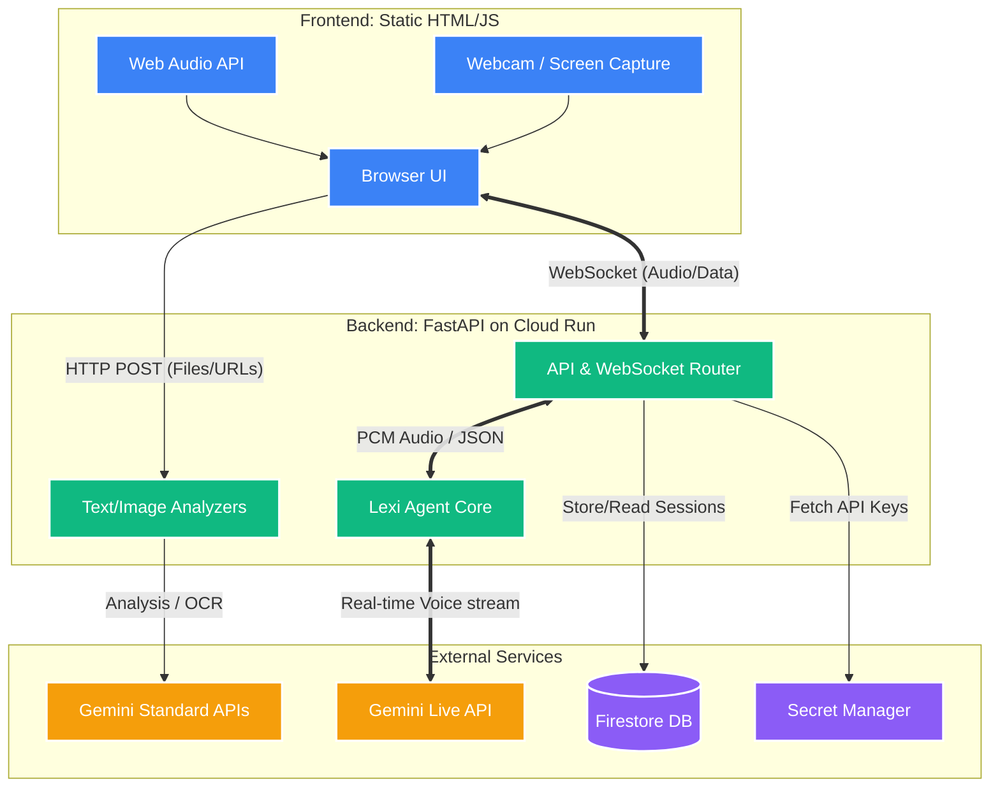

# LexiLens Architecture

This document outlines the high-level architecture of the LexiLens application.

```mermaid
graph TD
    %% Define Styles
    classDef frontend fill:#3b82f6,stroke:#fff,stroke-width:2px,color:#fff
    classDef backend fill:#10b981,stroke:#fff,stroke-width:2px,color:#fff
    classDef external fill:#f59e0b,stroke:#fff,stroke-width:2px,color:#fff
    classDef database fill:#8b5cf6,stroke:#fff,stroke-width:2px,color:#fff

    %% Frontend Components
    subgraph Frontend [Frontend: Static HTML/JS]
        UI[Browser UI]
        Audio[Web Audio API]
        Camera[Webcam / Screen Capture]
    end

    %% Backend Components
    subgraph Backend [Backend: FastAPI on Cloud Run]
        Router[API & WebSocket Router]
        Lexi[Lexi Agent Core]
        Tools[Text/Image Analyzers]
    end

    %% External Services
    subgraph External [External Services]
        GeminiLive[Gemini Live API]
        GeminiStandard[Gemini Standard APIs]
        Firestore[(Firestore DB)]
        SecretMan[Secret Manager]
    end

    %% Connections
    UI -- "HTTP POST (Files/URLs)" --> Tools
    UI <== "WebSocket (Audio/Data)" ==> Router
    Audio --> UI
    Camera --> UI

    Router <== "PCM Audio / JSON" ==> Lexi
    Lexi <== "Real-time Voice stream" ==> GeminiLive
    Tools -- "Analysis / OCR" --> GeminiStandard

    Router -- "Store/Read Sessions" --> Firestore
    Router -- "Fetch API Keys" --> SecretMan

    %% Apply Styles
    class UI,Audio,Camera frontend
    class Router,Lexi,Tools backend
    class GeminiLive,GeminiStandard external
    class Firestore,SecretMan database
```
